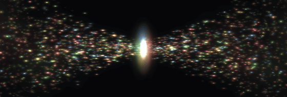

# MAESTRO



MAESTRO (Masked Encoding Set Transformer with self-distillation) learns one
fixed-length representation of an entire cytometry sample. It treats each sample
as an unordered set of cells and combines masked cell-set reconstruction with a
momentum-teacher self-distillation objective.

This fork is rooted in the rewritten public release of
[`matthew-lee1/MAESTRO`](https://github.com/matthew-lee1/MAESTRO). The core model
behavior and manuscript-facing settings remain aligned with that release, while
the training code is packaged under `src/` and the local production workflow uses
Hydra, `uv`, Slurm, and self-contained experiment directories.

## Installation

Python 3.10 or newer is required. The locked environment is authoritative:

```bash
uv sync --frozen --all-groups
```

The production launcher is specific to the Penn `dgx-b200` partition and loads
its CUDA module itself. PyTorch, Lightning, DeepSpeed, Hydra, GeomLoss/PyKeOps,
and notebook dependencies are all recorded in `pyproject.toml` and `uv.lock`.

## Production pretraining

The one supported configuration is [`configs/train.yaml`](configs/train.yaml).
It trains on the local `allof + prepro` snapshot with a 100,000-cell teacher
view, 40,000-cell student subset, and 40,000 reconstructed output cells.

Local biological data is expected at:

```text
data/raw/preprocessed-cyto-sources/allof/
data/raw/preprocessed-cyto-sources/prepro/
```

Submit the fixed four-GPU run with:

```bash
mkdir -p experiments
sbatch jobs/train-maestro.slurm
```

Every generated artifact for a job is stored under its owning directory in
`experiments/`, including resolved configuration, dataset inventory, Git
provenance, CSV metrics, GPU telemetry, Slurm logs, visualizations, and
checkpoints.

## Bundled upstream demo

The public upstream release includes a small synthetic dataset and an
under-trained ToyModel so the data format and downstream analysis can be explored
without the private production cohort. Those distributable fixtures are retained
here at their upstream paths.

| Fixture | Contents |
| --- | --- |
| `data/csv/dataA`, `data/h5/dataA` | 20 synthetic patients, 30 markers |
| `data/csv/dataB`, `data/h5/dataB` | 20 synthetic patients, 30 markers |
| `data/csv/metadata.csv` | Synthetic diagnosis and demographic metadata |
| `output/training/ToyModel/` | Upstream demo configuration and checkpoint |
| `notebooks/02-analyze-upstream-demo.ipynb` | Reconstruction, embeddings, prediction, robustness, and attention analyses |

The CSV files are human-readable sources and the HDF5 files contain the
model-ready `data`, `feature_names`, and `cell_types` datasets. The conversion
notebook is available at `data/00-convert-csv-to-h5.ipynb`. The converted HDF5
fixtures are already bundled, so this step is optional.

Launch the adapted upstream analysis notebook with:

```bash
uv run jupyter notebook notebooks/02-analyze-upstream-demo.ipynb
```

The bundled checkpoint uses a 4,000-cell student subset and decoder, hidden width
128, latent width 256, and 60 configured epochs. It is a demonstration artifact,
not a converged manuscript model, and its results are not comparable with the
fixed `allof + prepro` production configuration.

The tracked `output/training/ToyModel/` directory is an immutable demo fixture.
New training jobs must continue to write only beneath `experiments/`.

## Repository structure

```text
configs/train.yaml                 fixed Hydra configuration
jobs/train-maestro.slurm           four-GPU production launcher
src/data/dataset.py                HDF5 loading and marker intersection
src/models/maestro.py              model and Lightning module
src/training/runner.py             trainer, provenance, and run outputs
src/training/callbacks.py          DeepSpeed, EMA, and checkpoints
notebooks/01-explore-original-immune-health.ipynb
                                   original-cohort cell-level EDA
notebooks/02-analyze-upstream-demo.ipynb
                                   upstream ToyModel analysis
data/csv, data/h5                  tracked synthetic demo fixtures
data/raw                           ignored local biological data
output/training/ToyModel           tracked upstream demo checkpoint
experiments                        ignored generated run directories
```

## License and attribution

The project is distributed under the terms in [`LICENSE`](LICENSE). MAESTRO was
developed by Matthew E. Lee with E. John Wherry and Dokyoon Kim. Preserve the
upstream attribution when redistributing the model or demo materials.
